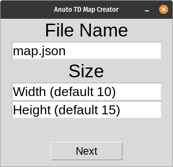
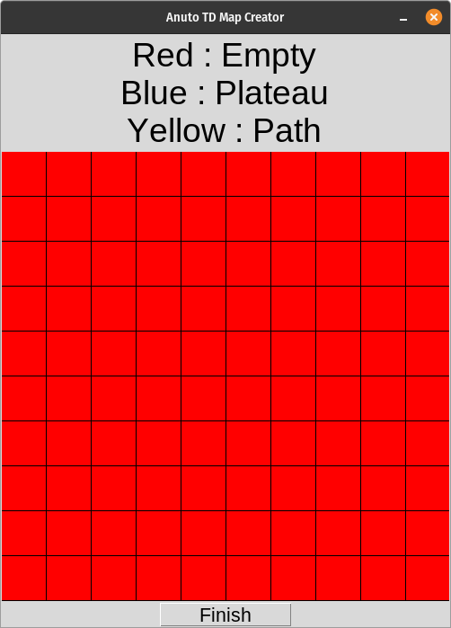
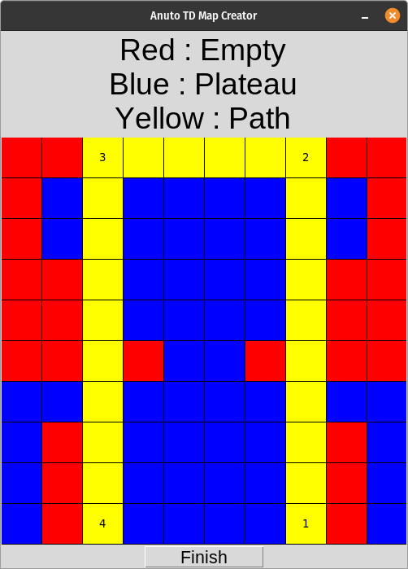

# ATD Map Creator

An ugly app which helps to make maps for [Anuto TD](https://github.com/reloZid/android-anuto)

## Attention!

This app isn't ready for full work, it's like mess of codes. It probably has lots of bugs. Just try to follow the instructions for your convenience.

## Instructions

### 1) Installation

- This app written with Pyhton 3, so first it should be installed Python 3 on your computer.
- To install app, just dowload zip and extract it.
- After installing app make 'atdmc.py' file executable and execute it.

### 2) File Name and Size

After you start the app, you will see this screen.

- You can edit final JSON file name or size of map (recommended size is 10x15). Or you can leave it for default.
- After you're done, click 'Next' button at the bottom. It will open map creating window.

### 3) Mapping

Map creating window will be like this.

- You can start making map now!
- Each 'left click' will switch block type.
- Red block is empty, blue block is plateau and yellow block is path.
- After you're done with blocks, you can start to make path. 'Right click' adds a waypoint to only path blocks.
- First and last point 'must' be on edge.
- You can only add points if it's in the same row or column of previous point.
- If your point has no connection with path blocks, you can't add it.
- IT SHOULD BE A PATH ON YOUR MAP!
- MAKING PATH OVER ANOTHER PATH CAN BREAK APP, IF YOU WANT TO DO THAT, BE READY TO BUGS!

An example:

When you're done, just click 'Finish'. App will close and you will find a JSON file which is your map.
