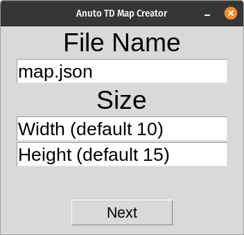
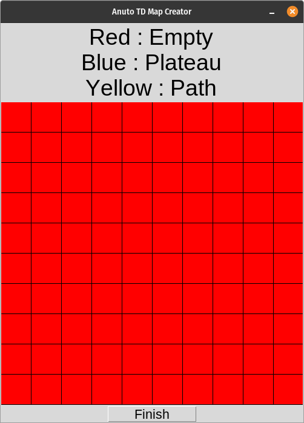

# ATD Map Creator

An app which helps to make maps for [Anuto TD](https://github.com/reloZid/android-anuto)

## Attention!

This app isn't ready for full work. It can have some issues. Just try to follow the instructions for your convenience.

## Instructions

### 1) Installation

- This app written with Pyhton 3, so first it should be installed Python 3 on your computer.
- To install app, just dowload zip and extract it.
- After installing app make 'atdmc.py' file executable and execute it.

### 2) File Name and Size

After you start the app, you will see this screen.

- You can edit final JSON file name or size of map (recommended size is 10x15). Or you can leave it for default.
- After you're done, click 'Next' button at the bottom. It will open map creating window.

### 3) Mapping

Map creating window will be like this.

- You can start making map now!
- Each 'left click' will switch block type.
- Red block is empty, blue block is plateau and yellow block is path.
- After you're done with blocks, you can start to make path. 'Right click' adds a waypoint to only path blocks.
- First and last point 'must' be on edge.
- You can only add points if it's in the same row or column of previous point.
- If your point has no connection with path blocks, you can't add it.
- IT SHOULD BE A PATH ON YOUR MAP!
- IF YOU WANT TO MAKE PATH OVER ANOTHER PATH PREPARE YOURSELF FOR POTENTIAL BUGS!

An example:

When you're done, just click 'Finish'. Mapping screen will close and you will find a JSON file which is your map. You can continue making maps with main screen.

## Adding New Maps

You need to follow these steps:
- Fork from [Anuto TD](https://github.com/reloZid/android-anuto)
- Create my_map.json (but think a different name) file with [atdmc](https://github.com/berkaygunduzz/atdmc)
- Add my_map.json to YOU/android-anuto/app/src/main/res/raw folder
- Add `<string name="my_map_name">My Map<string>` to YOU/android-anuto/app/src/main/res/values/strings.xml, don't forget to add `_name`
- Add `mMapInfos.add(new MapInfo("my", R.string.my_map_name, R.raw.my_map));` to YOU/android-anuto/app/src/main/java/ch/logixisland/anuto/business/game/MapRepository.java, "my" is map name (without spaces, uppercases and "map"), "my_map_name" is name in XML file, "my_map" is file name in raw (without ".json")
- Test map if you can
- After all you can create a merge request to main repository

## Issues and Contributing

### Issues

If you have some issues or suggests, you can create issues with that format:

- For app crashes, add `[CRASH]` to your issue title and tell what you do, what happened and what is error message
- For bugs, add `[BUG]` to your issue title head and tell what you do and what happened
- For editing app, add `[PERMISSION]` to your issue title and tell what do you want to do
- For suggest features, add `[FEATURE]` to your issue title and tell what do you suggest
- For how code works, add `[KNOWLEDGE]` to your issue title and tell what do you want to know
- For README problems, add `[README]` to your issue title and tell what is problem

### Contributing

If you want to change something you can create pull requests with that format:

- PLEASE APPLY PEP-8 OR IT WON'T BE MERGED
- PLEASE PULL REQUEST TO BRANCH [`dev`](https://github.com/berkaygunduzz/atdmc/tree/dev)
- Please follow previous codes and try to not messing codes
- There is a little probability that your idea won't be merged so please ask permission before for your own good
- For fixing app crashes, add `[FIX_CRASH]` to your pull request title and tell which crashes did you fixed and how
- For fixing bugs, add `[FIX_BUG]` to your pull request title head and tell which bugs did you fixed and how
- For gui changes, add `[CHANGE_GUI]` to your pull request title, tell what did you do and share how  new gui looks like
- For adding features, add `[ADD_FEATURE]` to your pull request title and tell what did you do
- For optimizing, add `[OPTIMIZE_CODE]` to your pull request title and tell what did you do and how it effected app with numbers
- For adding docstrings, add `[ADD_DOCSTRING]` to your pull request title
- For editing README, add `[EDIT_README]` to your pull request title and tell what did you change and why
